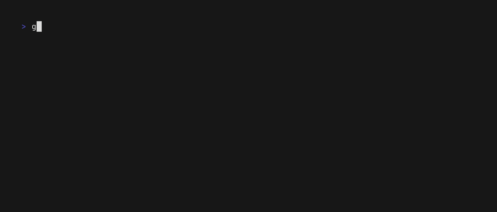

<p align="center">
  <a href="https://github.com/blacktop/go-gitfamous"></a>
  <h1 align="center">go-gitfamous</h1>
  <h4><p align="center">Github Event Tracker TUI</p></h4>
  <p align="center">
    <a href="https://github.com/blacktop/go-gitfamous/actions" alt="Actions">
          </a>
    <a href="https://github.com/blacktop/go-gitfamous/releases/latest" alt="Downloads">
          </a>
    <a href="https://github.com/blacktop/go-gitfamous/releases" alt="GitHub Release">
          </a>
    <a href="http://doge.mit-license.org" alt="LICENSE">
          </a>
</p>
<br>

## Why? 🤔

There are many *kinds* of being famous. This is just a very nerdy one. 🤓

## Getting Started

### Install

```bash
go install github.com/blacktop/go-gitfamous@latest
```

Or download the latest [release](https://github.com/blacktop/go-gitfamous/releases/latest)

### Usage

```bash
gitfamous <username>
```   

<!-- Fill this out -->



## License

MIT Copyright (c) <YEAR> **blacktop**